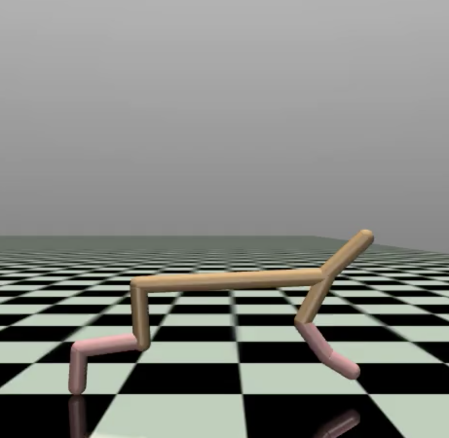

# Pure NumPy PPO for HalfCheetah-v4

A from-scratch Proximal Policy Optimization implementation using only NumPy. No PyTorch, no TensorFlow, no autograd. Every gradient is derived by hand, every matrix multiplication is explicit, every backprop step is written out.



---

## What This Is

A raw PPO agent that learns to run the MuJoCo HalfCheetah from state vectors. The entire learning algorithm fits in two files and uses nothing but `numpy` and `gymnasium`.


---

## Files

```
.
├── PPOagent.py              # Actor-critic networks with manual backprop
├── train.py                 # Training loop, GAE, reward shaping, checkpointing
├── plot.py                  # Evaluation + video rendering
├── requirements.txt         # numpy, gymnasium[mujoco], imageio
├── HalfCheetahVideo.mp4     # Trained agent running
├── HalfCheetah2300weights/  # Best checkpoint weights
└── README.md
```

---

## The Math

### PPO Clipped Objective

The policy is updated by maximizing a clipped surrogate:

$$\mathcal{L}^{CLIP}(\theta) = \min\left(r_t(\theta)\hat{A}_t, \ \text{clip}(r_t(\theta), 1-\epsilon, 1+\epsilon)\hat{A}_t\right)$$

where $r_t(\theta) = \exp(\log \pi_\theta(a|s) - \log \pi_{\theta_{old}}(a|s))$.

In code, the clipping gradient is computed with an explicit mask — if the clipped value is active, the gradient is zeroed:

```python
d_ratio = np.where(
    (surr1 < surr2) | (ratio < 1 - eps) | (ratio > 1 + eps),
    advantages * ratio, 0
)
d_log_pi = -d_ratio / len(states)
```

### Gaussian Policy Gradients

Actions are sampled from $\mathcal{N}(\mu_\theta(s), \sigma^2)$. The log-probability gradients are:

$$\frac{\partial \log \pi}{\partial \mu} = \frac{a - \mu}{\sigma^2}, \qquad \frac{\partial \log \pi}{\partial \log \sigma} = \frac{(a - \mu)^2}{\sigma^2} - 1$$

These flow backward through tanh hidden layers using $\tanh'(z) = 1 - \tanh^2(z)$:

```python
d_mu = d_log_pi * ((actions - mu) / variance)
dW3_a = self.a2_a.T @ d_mu
da2_a = d_mu @ self.W3_a.T
dz2_a = da2_a * (1.0 - self.a2_a ** 2)
dW2_a = self.a1_a.T @ dz2_a
```

$\log \sigma$ is a **state-independent learned parameter** clamped to $[-1.0, 0.5]$, keeping $\sigma \in [0.37, 1.65]$. This prevents both premature convergence and aimless thrashing.

### Observation Normalization (Welford's Algorithm)

Running mean and variance are tracked online without storing the full dataset:

$$M_{2,\text{new}} = M_{2,\text{old}} + M_{2,\text{batch}} + \Delta^2 \frac{N_{\text{old}} N_{\text{batch}}}{N_{\text{old}} + N_{\text{batch}}}$$

### Reward Shaping

A pitch penalty is applied during rollouts to prevent degenerate flipping gaits:

```python
torso_pitch = state[1]
if abs(torso_pitch) > 0.5:
    reward -= 2.0 * abs(torso_pitch)
```

### GAE

Generalized Advantage Estimation with $\gamma=0.99$, $\lambda=0.95$:

$$\hat{A}_t = \delta_t + (\gamma\lambda)\delta_{t+1} + \cdots + (\gamma\lambda)^{T-t+1}\delta_{T-1}$$

where $\delta_t = r_t + \gamma V(s_{t+1}) - V(s_t)$.

---

## Why Build This?

If you can't derive it by hand, you don't understand it. Writing backprop without autograd forces you to internalize every gradient, every loss surface, and every numerical subtlety. This repo is the artifact of that process.

---

